# Diagrama UML - Sistema de Cafetería E-commerce

## Diagrama Entidad-Relación (ERD) en formato PlantUML

```plantuml
@startuml Cafeteria_ERD

!define PRIMARY_KEY(x) <b><color:#b8861b><&key></color> x</b>
!define FOREIGN_KEY(x) <color:#aaaaaa><&key></color> x
!define COLUMN(x) <color:#efefef><&media-record></color> x
!define TABLE(x) entity x << (T, #FFAAAA) >>

' ==== ENTIDADES PRINCIPALES ====

TABLE(users) {
  PRIMARY_KEY(id) : BIGINT
  --
  COLUMN(name) : VARCHAR(255)
  COLUMN(email) : VARCHAR(255) UNIQUE
  COLUMN(email_verified_at) : TIMESTAMP NULL
  COLUMN(password) : VARCHAR(255)
  COLUMN(telefono) : VARCHAR(20) NULL
  COLUMN(direccion) : TEXT NULL
  COLUMN(estado) : ENUM('activo', 'inactivo')
  COLUMN(rol) : ENUM('cliente', 'superadmin', 'editor', 'gestor')
  COLUMN(metodo_autenticacion) : VARCHAR(50) NULL
  COLUMN(id_oauth) : VARCHAR(255) NULL
  COLUMN(avatar_url) : VARCHAR(255) NULL
  COLUMN(fecha_registro) : TIMESTAMP
  COLUMN(remember_token) : VARCHAR(100) NULL
  COLUMN(created_at) : TIMESTAMP
  COLUMN(updated_at) : TIMESTAMP
}

TABLE(categorias_productos) {
  PRIMARY_KEY(id) : BIGINT
  --
  COLUMN(nombre) : VARCHAR(100)
  COLUMN(descripcion) : TEXT NULL
  COLUMN(estado) : ENUM('activo', 'inactivo')
  COLUMN(created_at) : TIMESTAMP
  COLUMN(updated_at) : TIMESTAMP
}

TABLE(productos) {
  PRIMARY_KEY(id) : BIGINT
  --
  COLUMN(nombre) : VARCHAR(100)
  COLUMN(descripcion) : TEXT NULL
  COLUMN(precio) : DECIMAL(10,2)
  COLUMN(stock) : INT
  FOREIGN_KEY(categoria_producto_id) : BIGINT
  COLUMN(imagen_principal) : VARCHAR(255) NULL
  COLUMN(galeria_imagenes) : JSON NULL
  COLUMN(video_url) : VARCHAR(255) NULL
  COLUMN(estado) : ENUM('activo', 'inactivo')
  COLUMN(created_at) : TIMESTAMP
  COLUMN(updated_at) : TIMESTAMP
}

TABLE(carrito) {
  PRIMARY_KEY(id) : BIGINT
  --
  FOREIGN_KEY(user_id) : BIGINT
  COLUMN(estado) : ENUM('activo', 'finalizado', 'cancelado')
  COLUMN(created_at) : TIMESTAMP
  COLUMN(updated_at) : TIMESTAMP
}

TABLE(carrito_productos) {
  PRIMARY_KEY(id) : BIGINT
  --
  FOREIGN_KEY(carrito_id) : BIGINT
  FOREIGN_KEY(producto_id) : BIGINT
  COLUMN(cantidad) : INT
  COLUMN(created_at) : TIMESTAMP
  COLUMN(updated_at) : TIMESTAMP
}

TABLE(pedidos) {
  PRIMARY_KEY(id) : BIGINT
  --
  FOREIGN_KEY(user_id) : BIGINT
  COLUMN(total) : DECIMAL(10,2)
  COLUMN(estado) : ENUM('pendiente', 'pagado', 'enviado', 'completado', 'cancelado')
  COLUMN(direccion_envio) : TEXT
  COLUMN(id_transaccion_pago) : VARCHAR(255) NULL
  COLUMN(created_at) : TIMESTAMP
  COLUMN(updated_at) : TIMESTAMP
}

TABLE(detalle_pedido) {
  PRIMARY_KEY(id) : BIGINT
  --
  FOREIGN_KEY(pedido_id) : BIGINT
  FOREIGN_KEY(producto_id) : BIGINT
  COLUMN(cantidad) : INT
  COLUMN(precio_unitario) : DECIMAL(10,2)
  COLUMN(created_at) : TIMESTAMP
  COLUMN(updated_at) : TIMESTAMP
}

TABLE(cupones_descuento) {
  PRIMARY_KEY(id) : BIGINT
  --
  COLUMN(codigo) : VARCHAR(50) UNIQUE
  COLUMN(descripcion) : TEXT NULL
  COLUMN(tipo_descuento) : ENUM('porcentaje', 'monto_fijo')
  COLUMN(valor_descuento) : DECIMAL(10,2)
  COLUMN(fecha_inicio) : DATE
  COLUMN(fecha_expiracion) : DATE
  COLUMN(usos_maximos) : INT
  COLUMN(usos_actual) : INT
  COLUMN(estado) : ENUM('activo', 'inactivo')
  COLUMN(created_at) : TIMESTAMP
  COLUMN(updated_at) : TIMESTAMP
}

TABLE(pedido_cupon) {
  FOREIGN_KEY(pedido_id) : BIGINT
  FOREIGN_KEY(cupon_descuento_id) : BIGINT
  --
  COLUMN(descuento_aplicado) : DECIMAL(10,2)
  COLUMN(created_at) : TIMESTAMP
  COLUMN(updated_at) : TIMESTAMP
}

TABLE(suscripciones) {
  PRIMARY_KEY(id) : BIGINT
  --
  FOREIGN_KEY(user_id) : BIGINT
  COLUMN(nombre) : VARCHAR(100) NULL
  COLUMN(fecha_inicio) : DATE
  COLUMN(fecha_proximo_envio) : DATE
  COLUMN(frecuencia) : ENUM('mensual', 'trimestral', 'semestral')
  COLUMN(estado) : ENUM('activa', 'pausada', 'cancelada')
  COLUMN(total) : DECIMAL(10,2)
  COLUMN(created_at) : TIMESTAMP
  COLUMN(updated_at) : TIMESTAMP
}

TABLE(suscripcion_productos) {
  PRIMARY_KEY(id) : BIGINT
  --
  FOREIGN_KEY(suscripcion_id) : BIGINT
  FOREIGN_KEY(producto_id) : BIGINT
  COLUMN(cantidad) : INT
  COLUMN(created_at) : TIMESTAMP
  COLUMN(updated_at) : TIMESTAMP
}

TABLE(suscripcion_historial_envios) {
  PRIMARY_KEY(id) : BIGINT
  --
  FOREIGN_KEY(suscripcion_id) : BIGINT
  COLUMN(fecha_envio) : DATE
  COLUMN(estado) : ENUM('pendiente', 'enviado', 'entregado', 'cancelado')
  COLUMN(total) : DECIMAL(10,2) NULL
  FOREIGN_KEY(pedido_id) : BIGINT NULL
  COLUMN(created_at) : TIMESTAMP
  COLUMN(updated_at) : TIMESTAMP
}

TABLE(comentarios_calificaciones) {
  PRIMARY_KEY(id) : BIGINT
  --
  FOREIGN_KEY(user_id) : BIGINT
  FOREIGN_KEY(producto_id) : BIGINT
  FOREIGN_KEY(pedido_id) : BIGINT
  COLUMN(calificacion) : INT CHECK(1-5)
  COLUMN(comentario) : TEXT NULL
  COLUMN(estado) : ENUM('activo', 'oculto')
  COLUMN(created_at) : TIMESTAMP
  COLUMN(updated_at) : TIMESTAMP
}

' ==== RELACIONES ====

' Relaciones User
users ||--o{ carrito : "user_id"
users ||--o{ pedidos : "user_id"
users ||--o{ suscripciones : "user_id"
users ||--o{ comentarios_calificaciones : "user_id"

' Relaciones Categorías y Productos
categorias_productos ||--o{ productos : "categoria_producto_id"

' Relaciones Carrito
carrito ||--o{ carrito_productos : "carrito_id"
productos ||--o{ carrito_productos : "producto_id"

' Relaciones Pedidos
pedidos ||--o{ detalle_pedido : "pedido_id"
productos ||--o{ detalle_pedido : "producto_id"

' Relaciones Cupones
pedidos ||--o{ pedido_cupon : "pedido_id"
cupones_descuento ||--o{ pedido_cupon : "cupon_descuento_id"

' Relaciones Suscripciones
suscripciones ||--o{ suscripcion_productos : "suscripcion_id"
productos ||--o{ suscripcion_productos : "producto_id"
suscripciones ||--o{ suscripcion_historial_envios : "suscripcion_id"
pedidos ||--o| suscripcion_historial_envios : "pedido_id"

' Relaciones Comentarios
productos ||--o{ comentarios_calificaciones : "producto_id"
pedidos ||--o{ comentarios_calificaciones : "pedido_id"

@enduml
```

## Diagrama de Clases del Modelo de Datos (13 Tablas)

```plantuml
@startuml Cafeteria_Models_13_Tables

!theme plain
skinparam class {
    BackgroundColor lightblue
    BorderColor black
    FontSize 10
}

class User {
  + id: bigint
  + name: string
  + email: string (unique)
  + email_verified_at: timestamp
  + password: string
  + telefono: string(20)
  + direccion: text
  + estado: enum('activo','inactivo')
  + rol: enum('cliente','superadmin','editor','gestor')
  + metodo_autenticacion: string(50)
  + id_oauth: string
  + avatar_url: string
  + fecha_registro: timestamp
  + remember_token: string(100)
  + created_at: timestamp
  + updated_at: timestamp
  --
  + carritos(): HasMany
  + pedidos(): HasMany
  + suscripciones(): HasMany
  + comentarios(): HasMany
  + getEsActivoAttribute(): bool
  + scopeActivos(query): Builder
  + scopeClientes(query): Builder
}

class CategoriaProducto {
  + id: bigint
  + nombre: string(100)
  + descripcion: text
  + estado: enum('activo','inactivo')
  + created_at: timestamp
  + updated_at: timestamp
  --
  + productos(): HasMany
  + scopeActivas(query): Builder
}

class Producto {
  + id: bigint
  + nombre: string(100)
  + descripcion: text
  + precio: decimal(10,2)
  + stock: int
  + categoria_producto_id: bigint (FK)
  + imagen_principal: string
  + galeria_imagenes: json
  + video_url: string
  + estado: enum('activo','inactivo')
  + created_at: timestamp
  + updated_at: timestamp
  --
  + categoria(): BelongsTo
  + carritoProductos(): HasMany
  + detallesPedido(): HasMany
  + suscripcionProductos(): HasMany
  + comentarios(): HasMany
  + scopeDisponibles(query): Builder
  + scopeActivos(query): Builder
}

class Carrito {
  + id: bigint
  + user_id: bigint (FK)
  + estado: enum('activo','finalizado','cancelado')
  + created_at: timestamp
  + updated_at: timestamp
  --
  + user(): BelongsTo
  + productos(): BelongsToMany
  + carritoProductos(): HasMany
  + scopeActivos(query): Builder
}

class CarritoProducto {
  + id: bigint
  + carrito_id: bigint (FK)
  + producto_id: bigint (FK)
  + cantidad: int
  + created_at: timestamp
  + updated_at: timestamp
  --
  + carrito(): BelongsTo
  + producto(): BelongsTo
}

class Pedido {
  + id: bigint
  + user_id: bigint (FK)
  + total: decimal(10,2)
  + estado: enum('pendiente','pagado','enviado','completado','cancelado')
  + direccion_envio: text
  + id_transaccion_pago: string
  + created_at: timestamp
  + updated_at: timestamp
  --
  + user(): BelongsTo
  + detalles(): HasMany
  + productos(): BelongsToMany
  + cupones(): BelongsToMany
  + comentarios(): HasMany
  + historialEnvios(): HasMany
  + scopePorEstado(query, estado): Builder
}

class DetallePedido {
  + id: bigint
  + pedido_id: bigint (FK)
  + producto_id: bigint (FK)
  + cantidad: int
  + precio_unitario: decimal(10,2)
  + created_at: timestamp
  + updated_at: timestamp
  --
  + pedido(): BelongsTo
  + producto(): BelongsTo
}

class CuponDescuento {
  + id: bigint
  + codigo: string(50) (unique)
  + descripcion: text
  + tipo_descuento: enum('porcentaje','monto_fijo')
  + valor_descuento: decimal(10,2)
  + fecha_inicio: date
  + fecha_expiracion: date
  + usos_maximos: int
  + usos_actual: int
  + estado: enum('activo','inactivo')
  + created_at: timestamp
  + updated_at: timestamp
  --
  + pedidos(): BelongsToMany
  + scopeVigentes(query): Builder
  + scopeActivos(query): Builder
  + calcularDescuento(total): decimal
}

class PedidoCupon {
  + pedido_id: bigint (FK, PK)
  + cupon_descuento_id: bigint (FK, PK)
  + descuento_aplicado: decimal(10,2)
  + created_at: timestamp
  + updated_at: timestamp
  --
  + pedido(): BelongsTo
  + cupon(): BelongsTo
}

class Suscripcion {
  + id: bigint
  + user_id: bigint (FK)
  + nombre: string(100)
  + fecha_inicio: date
  + fecha_proximo_envio: date
  + frecuencia: enum('mensual','trimestral','semestral')
  + estado: enum('activa','pausada','cancelada')
  + total: decimal(10,2)
  + created_at: timestamp
  + updated_at: timestamp
  --
  + user(): BelongsTo
  + productos(): BelongsToMany
  + suscripcionProductos(): HasMany
  + historialEnvios(): HasMany
  + scopeActivas(query): Builder
  + calcularProximoEnvio(): date
}

class SuscripcionProducto {
  + id: bigint
  + suscripcion_id: bigint (FK)
  + producto_id: bigint (FK)
  + cantidad: int
  + created_at: timestamp
  + updated_at: timestamp
  --
  + suscripcion(): BelongsTo
  + producto(): BelongsTo
}

class SuscripcionHistorialEnvio {
  + id: bigint
  + suscripcion_id: bigint (FK)
  + fecha_envio: date
  + estado: enum('pendiente','enviado','entregado','cancelado')
  + total: decimal(10,2)
  + pedido_id: bigint (FK, nullable)
  + created_at: timestamp
  + updated_at: timestamp
  --
  + suscripcion(): BelongsTo
  + pedido(): BelongsTo
  + scopePorEstado(query, estado): Builder
}

class ComentarioCalificacion {
  + id: bigint
  + user_id: bigint (FK)
  + producto_id: bigint (FK)
  + pedido_id: bigint (FK)
  + calificacion: int (1-5)
  + comentario: text
  + estado: enum('activo','oculto')
  + created_at: timestamp
  + updated_at: timestamp
  --
  + user(): BelongsTo
  + producto(): BelongsTo
  + pedido(): BelongsTo
  + scopeActivos(query): Builder
  + scopePorCalificacion(query, calificacion): Builder
}

' ======= RELACIONES PRINCIPALES =======

' 1. USUARIO COMO CENTRO DEL SISTEMA
User ||--o{ Carrito : "user_id"
User ||--o{ Pedido : "user_id"
User ||--o{ Suscripcion : "user_id"
User ||--o{ ComentarioCalificacion : "user_id"

' 2. CATÁLOGO DE PRODUCTOS
CategoriaProducto ||--o{ Producto : "categoria_producto_id"

' 3. CARRITO DE COMPRAS
Carrito ||--o{ CarritoProducto : "carrito_id"
Producto ||--o{ CarritoProducto : "producto_id"

' 4. SISTEMA DE PEDIDOS
Pedido ||--o{ DetallePedido : "pedido_id"
Producto ||--o{ DetallePedido : "producto_id"

' 5. CUPONES Y DESCUENTOS
Pedido ||--o{ PedidoCupon : "pedido_id"
CuponDescuento ||--o{ PedidoCupon : "cupon_descuento_id"

' 6. SUSCRIPCIONES
Suscripcion ||--o{ SuscripcionProducto : "suscripcion_id"
Producto ||--o{ SuscripcionProducto : "producto_id"
Suscripcion ||--o{ SuscripcionHistorialEnvio : "suscripcion_id"
Pedido ||--o| SuscripcionHistorialEnvio : "pedido_id (nullable)"

' 7. RESEÑAS Y CALIFICACIONES
Producto ||--o{ ComentarioCalificacion : "producto_id"
Pedido ||--o{ ComentarioCalificacion : "pedido_id"

' ======= NOTAS DEL DIAGRAMA =======
note top of User : Centro del sistema\nAutenticación OAuth\nRoles múltiples
note top of Producto : Multimedia support\nJSON galería imágenes\nControl de inventario
note top of PedidoCupon : Tabla pivot\nClave primaria compuesta
note top of ComentarioCalificacion : Constraint: 1-5 estrellas\nUnique: user+producto+pedido

@enduml
```

## Tablas del Sistema (13 tablas principales)

### ✅ Lista Completa de Tablas:

1. **users** (tabla principal de Laravel modificada)
2. **categorias_productos** 
3. **productos**
4. **carrito**
5. **carrito_productos** 
6. **pedidos**
7. **detalle_pedido**
8. **cupones_descuento**
9. **pedido_cupon** (tabla pivot)
10. **suscripciones**
11. **suscripcion_productos**
12. **suscripcion_historial_envios**
13. **comentarios_calificaciones**

**Nota**: La tabla `usuarios` (2025_09_17_160839_create_usuarios_table.php) es un archivo legacy que debe eliminarse ya que se decidió usar la tabla `users` de Laravel.

## Descripción del Sistema

### 🏗️ Arquitectura General
El sistema de cafetería está diseñado como una plataforma de e-commerce completa con las siguientes características:

#### **Módulos Principales:**
1. **Gestión de Usuarios** - Autenticación, roles, perfiles
2. **Catálogo de Productos** - Categorías, productos, multimedia
3. **Carrito de Compras** - Gestión de productos seleccionados
4. **Procesamiento de Pedidos** - Órdenes, pagos, seguimiento
5. **Sistema de Suscripciones** - Entregas recurrentes automatizadas
6. **Cupones y Descuentos** - Promociones y códigos de descuento
7. **Reseñas y Calificaciones** - Feedback de clientes

### 📊 Entidades Principales

#### **Users (Usuarios)**
- **Propósito**: Gestión centralizada de usuarios del sistema
- **Características**: Roles múltiples (cliente, admin, gestor), autenticación OAuth, perfiles completos
- **Relaciones**: Centro del sistema, relacionado con todas las transacciones

#### **Productos y Categorías**
- **Propósito**: Catálogo completo de productos de cafetería
- **Características**: Multimedia (imágenes, videos), control de inventario, categorización
- **Funcionalidades**: Stock management, galería de imágenes JSON, estados activo/inactivo

#### **Sistema de Carrito**
- **Propósito**: Gestión temporal de productos antes de la compra
- **Características**: Sesión persistente, múltiples productos, cantidades variables
- **Flujo**: Carrito → Pedido → Procesamiento de pago

#### **Gestión de Pedidos**
- **Propósito**: Procesamiento completo de órdenes de compra
- **Características**: Estados múltiples, integración de pagos, detalle de productos
- **Seguimiento**: Desde pendiente hasta completado/cancelado

#### **Sistema de Suscripciones**
- **Propósito**: Entregas automáticas recurrentes
- **Características**: Frecuencias configurables, historial de envíos, gestión de productos
- **Automatización**: Generación automática de pedidos según frecuencia

#### **Cupones de Descuento**
- **Propósito**: Sistema promocional flexible
- **Características**: Porcentajes o montos fijos, límites de uso, vigencia temporal
- **Control**: Usos máximos, estado activo/inactivo

#### **Reseñas y Calificaciones**
- **Propósito**: Feedback y valoración de productos
- **Características**: Calificaciones 1-5 estrellas, comentarios opcionales, moderación
- **Restricciones**: Un comentario por usuario/producto/pedido

### 🔗 Relaciones Clave

#### **Relaciones One-to-Many:**
- `User` → `Carritos`, `Pedidos`, `Suscripciones`, `Comentarios`
- `CategoriaProducto` → `Productos`
- `Pedido` → `DetallePedido`
- `Suscripcion` → `SuscripcionProductos`, `HistorialEnvios`

#### **Relaciones Many-to-Many:**
- `Carrito` ↔ `Productos` (a través de `carrito_productos`)
- `Pedido` ↔ `Productos` (a través de `detalle_pedido`)
- `Pedido` ↔ `CuponDescuento` (a través de `pedido_cupon`)
- `Suscripcion` ↔ `Productos` (a través de `suscripcion_productos`)

### 🚀 Funcionalidades Avanzadas

#### **Optimizaciones de Performance:**
- **Índices Compuestos**: Para consultas frecuentes (usuario-estado, producto-categoría)
- **Vistas SQL**: `productos_populares`, `estadisticas_usuarios`
- **Restricciones**: Check constraints para calificaciones, unique constraints

#### **Integridad de Datos:**
- **Foreign Keys**: Con políticas CASCADE y RESTRICT apropiadas
- **Validaciones**: Enum values, rangos de calificaciones
- **Constraints**: Prevención de duplicados en relaciones críticas

#### **Escalabilidad:**
- **JSON Fields**: Para galerías de imágenes flexibles
- **Timestamps**: Auditoria completa de cambios
- **Estados**: Control granular del ciclo de vida de entidades

### 📋 Casos de Uso Principales

1. **Flujo de Compra Estándar:**
   Usuario → Navegación de Productos → Carrito → Pedido → Pago → Entrega

2. **Suscripciones Automáticas:**
   Usuario → Configuración de Suscripción → Entregas Recurrentes → Historial

3. **Sistema de Recompensas:**
   Compra → Cupones → Descuentos → Fidelización

4. **Gestión de Inventario:**
   Productos → Stock → Categorías → Estados → Reportes

### 📊 Resumen Técnico

**Conteo Final de Tablas:**
- ✅ **13 tablas principales** del sistema de cafetería
- ✅ **1 tabla users** modificada de Laravel como centro del sistema  
- ⚠️ **1 tabla `usuarios`** legacy que debe eliminarse (duplicada)

**Tablas Activas (13):**
1. users, 2. categorias_productos, 3. productos, 4. carrito, 5. carrito_productos, 6. pedidos, 7. detalle_pedido, 8. cupones_descuento, 9. pedido_cupon, 10. suscripciones, 11. suscripcion_productos, 12. suscripcion_historial_envios, 13. comentarios_calificaciones

**Características del Diagrama:**
- ✅ Todas las relaciones One-to-Many y Many-to-Many
- ✅ Tipos de datos precisos según migraciones
- ✅ Constraints y validaciones incluidas
- ✅ Métodos de modelo y scopes documentados
- ✅ Índices de performance mencionados

Este diseño proporciona una base sólida para una plataforma de e-commerce de cafetería completa, escalable y mantenible.